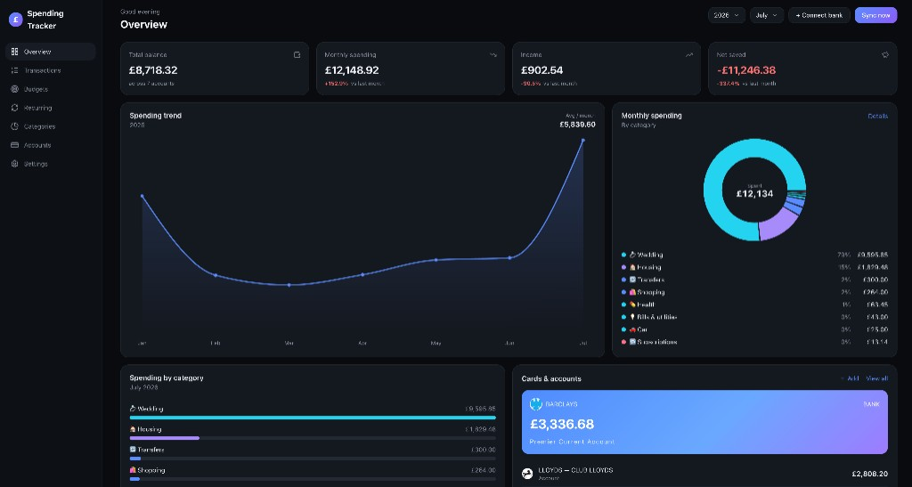
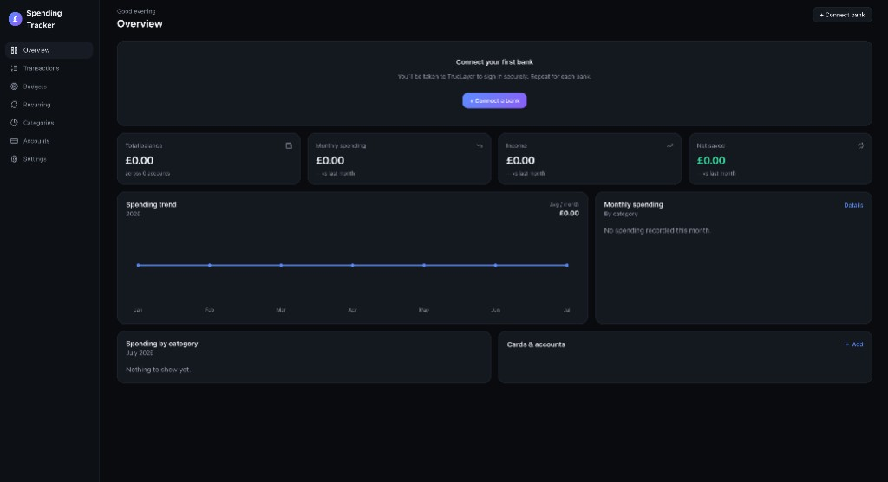

# 💷 Spending Tracker

A private monthly-expenditure dashboard for your UK bank accounts (Lloyds,
Barclays, HSBC, NatWest, Monzo, Starling, Revolut, …). It pulls **money in /
money out** automatically via [TrueLayer](https://truelayer.com) (UK Open
Banking) — no manual entry — and aggregates every account into one view.



You sign in with Google, connect each bank once, and the app keeps your
transactions, balances, budgets and recurring payments up to date in the
background.

---

## How it works

```
Google sign-in ─► your session
Your bank ──OAuth/SCA──► TrueLayer Data API ──► this app ──► Neon Postgres ──► dashboard
                                                     ▲
                                Vercel Cron (daily) ─┘  background sync + token refresh
```

- **Auth** — Google login via Auth.js (NextAuth v5), stateless JWT session.
  Data is scoped per user.
- **Data** — transactions/accounts/budgets live in **Neon Postgres**, accessed
  through **Drizzle ORM** (async, serverless-friendly).
- **Bank tokens** — TrueLayer access/refresh tokens are **encrypted at rest**
  (AES-256-GCM) with `TOKEN_ENC_KEY`.
- **Freshness** — a daily Vercel Cron job refreshes the rolling window and
  rotates near-expiry tokens so bank consent stays alive between logins.

You authorise each bank once. Consent lasts ~90 days (a UK Open Banking rule),
then you click **Connect a bank** again to re-connect. TrueLayer hosts the bank
picker, so you connect one bank at a time and they all aggregate into one view.

Before connecting a bank, the dashboard starts empty:



---

## Tech stack

- [Next.js 15](https://nextjs.org) (App Router) + React 19
- [Auth.js / NextAuth v5](https://authjs.dev) — Google OAuth
- [Neon Postgres](https://neon.tech) + [Drizzle ORM](https://orm.drizzle.team)
- [TrueLayer](https://truelayer.com) Data API (UK Open Banking)
- Tailwind CSS v4 + Recharts
- Deployed on [Vercel](https://vercel.com) (serverless functions + Cron)

---

## Local development

### 1. Prerequisites

- Node.js 20+
- A **Neon Postgres** database (free tier is fine) — grab the pooled connection
  string from the Neon dashboard (**Connect → Pooled connection**).
- A **Google OAuth client** (Google Cloud Console → APIs & Services →
  Credentials) with redirect URI `http://localhost:3000/api/auth/callback/google`.
- A **TrueLayer application** (free) from **https://console.truelayer.com**:
  - Note its **Client ID** and **Client Secret**.
  - Use the **Live** environment (or **Sandbox** to test with mock banks) — the
    credentials must match `TRUELAYER_ENV`.
  - Add redirect URI `http://localhost:3000/api/callback`
    (TrueLayer allows `localhost`, so no tunnel is needed).

### 2. Configure environment

```bash
cp .env.example .env.local
```

Fill in `.env.local` (see the file for full comments):

| Variable | What it is |
|----------|-----------|
| `DATABASE_URL` | Neon pooled Postgres connection string |
| `AUTH_SECRET` | `node -e "console.log(require('crypto').randomBytes(32).toString('base64'))"` |
| `AUTH_GOOGLE_ID` / `AUTH_GOOGLE_SECRET` | Google OAuth client credentials |
| `TRUELAYER_ENV` | `live` or `sandbox` |
| `TRUELAYER_CLIENT_ID` / `TRUELAYER_CLIENT_SECRET` | TrueLayer app credentials |
| `APP_BASE_URL` | `http://localhost:3000` for local dev |
| `TOKEN_ENC_KEY` | 32-byte key for encrypting bank tokens at rest |
| `CRON_SECRET` | Shared secret protecting `/api/cron` (needed in prod) |

### 3. Apply the database schema

```bash
npm install
npm run db:migrate     # applies Drizzle migrations to DATABASE_URL
```

### 4. Run

```bash
npm run dev
```

Open http://localhost:3000, sign in with Google, click **Connect a bank**, pick
your bank and authorise on TrueLayer's secure flow. You'll be redirected back
with your transactions loading. Repeat for each bank; use **Sync now** any time
to pull the latest.

---

## Useful scripts

| Script | Purpose |
|--------|---------|
| `npm run dev` | Start the dev server |
| `npm run build` / `npm run start` | Production build / serve |
| `npm run db:generate` | Generate a new Drizzle migration from `src/lib/schema.ts` |
| `npm run db:migrate` | Apply migrations to `DATABASE_URL` |
| `npm run db:push` | Push schema directly (no migration file) |
| `npm run db:migrate:data` | One-off import from a legacy `data/spending.db` (SQLite) into Postgres |

---

## Deploying to Vercel

1. Push the repo to GitHub and import it into Vercel (Next.js is auto-detected).
2. Set all the environment variables above in **Settings → Environment
   Variables** (use a separate Neon prod database, and set `APP_BASE_URL` to
   your Vercel domain). Rotate/generate fresh secrets for production.
3. Run `npm run db:migrate` against the production `DATABASE_URL`.
4. Update redirect URIs to your domain:
   - Google: `https://<domain>/api/auth/callback/google`
   - TrueLayer: `https://<domain>/api/callback`
5. Confirm your TrueLayer **live** app is approved for production Data API
   access.

`vercel.json` schedules a daily Cron hit to `/api/cron` (background sync + token
refresh), guarded by `CRON_SECRET`. Long routes (`/api/sync`, `/api/callback`,
`/api/cron`) set `maxDuration = 300`; the connect callback redirects immediately
and runs the deep history backfill out-of-band via `after()`.

---

## Notes & limits (Open Banking rules, not app bugs)

- **~90-day history** on first connect (up to ~23 months during a fresh consent
  session); you build up more over time.
- **Re-consent every ~90 days** — just click **Connect a bank** again.
- **Read-only** — the app can see transactions and balances, never move money.
- **Single currency** — totals sum raw amounts (no FX). Fine for all-GBP banks.
- **Categories** are rule-based; edit `src/lib/categorize.ts` to tune them.

---

## Layout

| Path | Purpose |
|------|---------|
| `src/auth.ts` | Auth.js (Google) configuration |
| `src/lib/schema.ts` | Drizzle table definitions |
| `src/lib/db-client.ts` | Neon Postgres + Drizzle client |
| `src/lib/db.ts` | Data-access layer + monthly aggregation |
| `src/lib/truelayer.ts` | TrueLayer OAuth + Data API client |
| `src/lib/sync.ts` | Fetch + categorise + store transactions (token refresh) |
| `src/lib/crypto.ts` | AES-256-GCM encryption for stored bank tokens |
| `src/lib/categorize.ts` | Rule-based categorisation (edit me) |
| `src/app/api/*` | auth / banks / connect / callback / sync / summary / budgets / categorize / cron |
| `src/app/*` | Dashboard, transactions, budgets, recurring, categories, accounts, settings pages |
